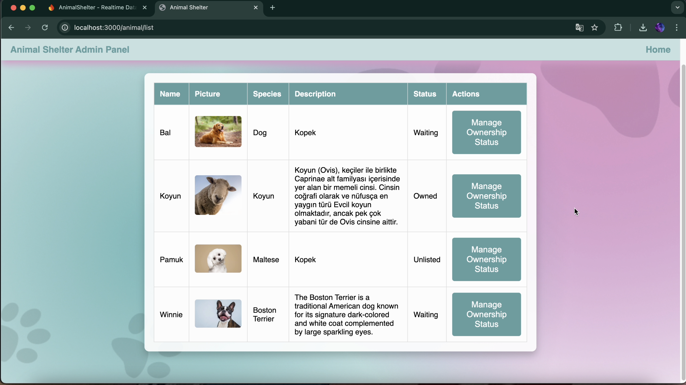
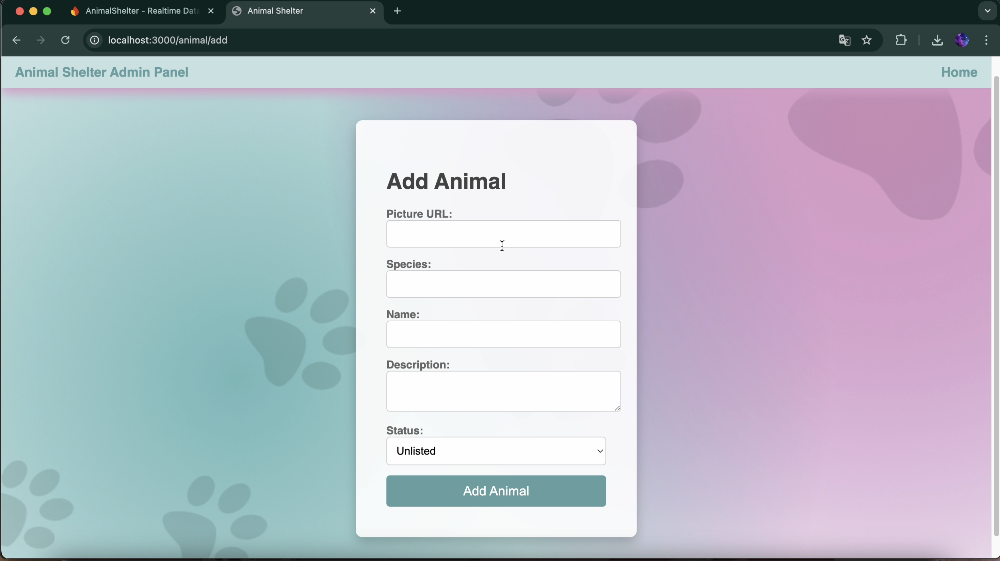
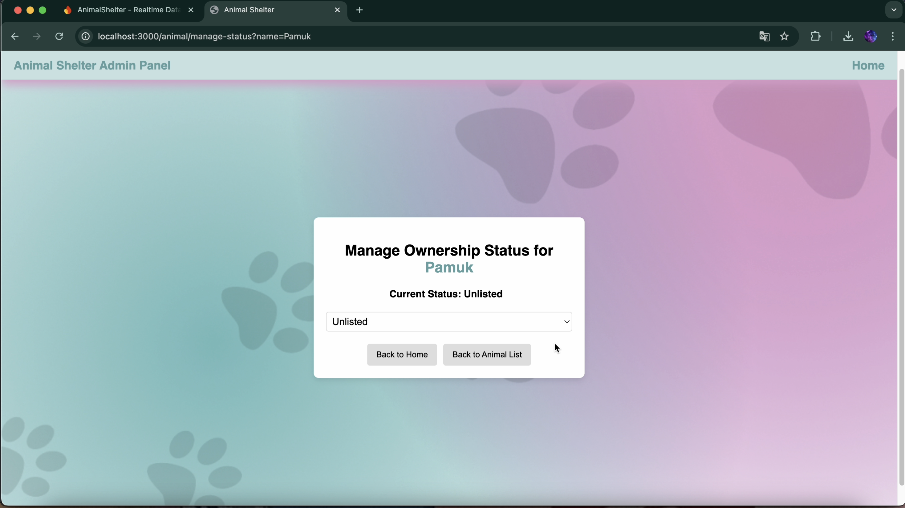

# Animal Shelter Admin Panel

This project is a web application for managing a local animal shelter, built using Next.js, Redux for state management, and Firebase for database and storage. The application allows you to list animals, add new animals to the database, and manage their status.

## Table of Contents

- [Project Overview](#project-overview)
- [Features](#features)
- [Technologies Used](#technologies-used)
- [Installation](#installation)
- [Usage](#usage)
- [Screenshots](#screenshots)
- [Video Demo](#video-demo)

## Project Overview

The Animal Shelter Admin Panel is designed to facilitate the management of animals in a shelter. The main features include listing animals, adding new animals, and managing their ownership status.

## Features

- **List Animals:** View all animals in a table format, including their picture, species, name, description, and ownership status.
- **Add Animals:** Add new animals to the database with all relevant details.
- **Manage Status:** Update the ownership status of animals (Unlisted, Waiting, Owned).

## Technologies Used

- **Next.js:** Framework for server-side rendering and generating static websites.
- **Redux:** State management library for React applications.
- **Firebase:** Used for database and storage.
- **CSS:** Styling the application.

## Installation

1. Clone the repository:
   ```bash
   git clone https://github.com/CerenErsoz/Animal-Shelter-Admin-Panel.git
   ```
2. Navigate to the project directory:
   ```bash
   cd animal-shelter-admin-panel
   ```
3. Install the dependencies:
   ```bash
   npm install
   ```
4. Set up your Firebase configuration in the `firebase.js` file.

5. Start the development server:
   ```bash
   npm run dev
   ```

## Usage

Once the server is running, you can access the application in your browser at `http://localhost:3000`. Use the application to view, add, and manage animals in the shelter.

## Screenshots

### Animal List View



### Add Animal Form



### Manage Animal Status



## Video Demo

Here is a video walkthrough of the application:


